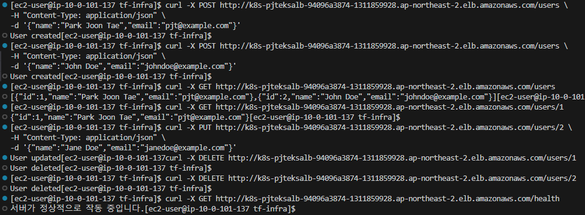
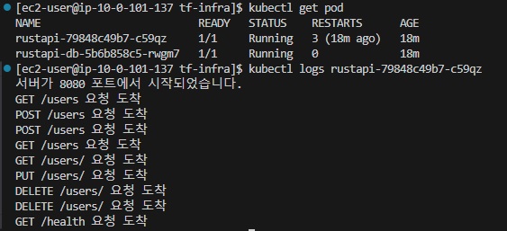
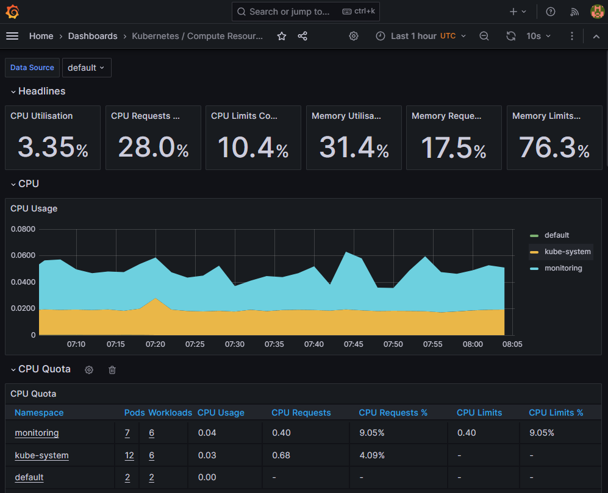
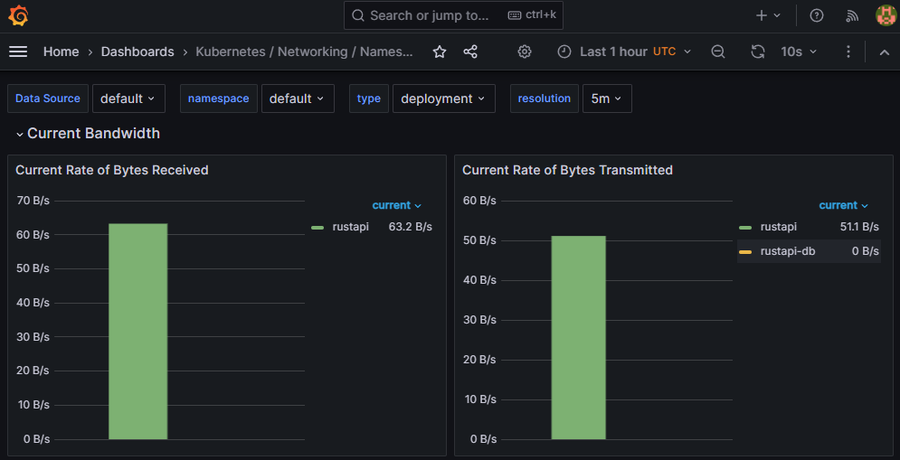

# Terraform Infra

이 리포지토리는 AWS에서 EKS 클러스터와 관련된 인프라를 Terraform을 사용하여 구축하고 관리하기 위한 코드들을 포함하고 있습니다.

## 구축 결과





## 리포지토리 구조

```plaintext
tf-infra/
├── README.md
├── eks/
│   ├── alb-controller-helm.tf
│   ├── alb-controller-policy.tf
│   ├── ca-helm.tf
│   ├── ca-policy.tf
│   ├── data.tf
│   ├── ebs-csi.tf
│   ├── eks-cluster.tf
│   ├── grafana-ingress.yaml
│   ├── iamserviceaccount.tf
│   ├── prometheus-grafana-helm.tf
│   └── provider.tf
├── eks-bastion/
│   ├── bastion-userdata.sh
│   ├── data.tf
│   └── eks-bastion.tf
├── rustapi-helm-chart/
│   ├── Chart.yaml
│   ├── templates/
│   │   ├── deployment.yaml
│   │   ├── ingress.yaml
│   │   ├── pvc.yaml
│   │   └── service.yaml
│   └── values.yaml
└── vpc/
    ├── provider.tf
    ├── variables.tf
    └── vpc.tf
```

### 1. VPC 설정 (vpc 디렉토리)
Terraform으로 `VPC`에 `2개의 public/private Subnet`과 `IGW`, `NAT GW`를 구성합니다.

- **provider.tf**: AWS provider 설정 파일입니다.
- **variables.tf**: VPC 생성에 필요한 변수들을 정의합니다.
- **vpc.tf**: VPC, 서브넷, 라우팅 테이블 등을 포함한 네트워크 인프라를 구성합니다.

### 2. EKS 클러스터 설정 (eks 디렉토리)
Terraform으로 `EKS`와 `Helm`을 사용한 `ALB Controller, Cluster Autoscaler, API Server, Prometheus, Grafana`와 `EBS-CSI` 애드온을 구성합니다.

- **provider.tf**: AWS, Kubernetes, Helm, S3 상태관리 provider 설정 파일입니다.
- **data.tf**: data 참조 파일입니다.
- **eks-cluster.tf**: EKS와 관리형 노드 그룹, 보안 그룹 등을 생성합니다.
- **alb-controller-helm.tf**: AWS Load Balancer Controller를 설치하기 위해 Helm Chart를 EKS에 배포합니다.
- **alb-controller-iam.tf**: ALB Controller가 EKS에서 작동할 수 있도록 필요한 IAM 정책, 역할을 정의합니다.
- **ca-helm.tf**: Cluster Autoscaler를 설치하기 위한 Helm Chart를 EKS에 배포합니다.
- **ca-iam.tf**: Cluster Autoscaler에 필요한 IAM 정책을 정의합니다.
- **ebs-csi.tf**: EKS에서 EBS CSI 드라이버를 사용하기 위한 애드온과 IAM 역할을 정의합니다.
- **grafana-ingress.yaml**: Grafana Ingress를 정의하여 ALB를 통해 외부에서 접근할 수 있도록 설정합니다.
- **iamserviceaccount.tf**: ALB와 CA에 필요한 IAM Service Account를 생성하는 코드입니다.
- **rustapi-helm.tf**: rustapi서버와 postgresql db를 설치하기 위한 Helm Chart를 EKS에 배포합니다.
- **prometheus-grafana-helm.tf**: Prometheus 및 Grafana를 설치하기 위한 Helm Chart를 EKS에 배포합니다.

### 3. Bastion 호스트 설정 (eks-bastion 디렉토리)
Terraform으로 `EKS`에 접근하기 위한 `Bastion 호스트`를 구성합니다.

- **eks-bastion.tf**: Bastion 호스트 인스턴스를 구성합니다.
- **bastion-userdata.sh**: Bastion 호스트 인스턴스의 초기 설정 스크립트입니다. awscli, kubectl, eksctl, terraform, helm 등을 설치합니다.
- **data.tf**: data 참조 파일입니다.

### 4. Rust API 서버 설정 (rustapi-helm-chart 디렉토리)
`API Server`, `postgresql`배포를 `Helm Chart`를 통해 관리합니다.

- **Chart.yaml**: Helm 차트에 대한 메타데이터를 정의합니다.
- **values.yaml**: 이미지, 포트, DB정보, 경로 등을 설정합니다.
- **templates/**
    - **deployment.yaml**: rustapi 서버와 postgresql DB deployment 파일입니다.
    - **ingress.yaml**: rustapi ingress 파일입니다.
    - **pvc.yaml**: PVC를 정의해 데이터 저장소를 설정합니다.
    - **service.yaml**: rustapi 서버와 postgresql DB service 파일입니다.